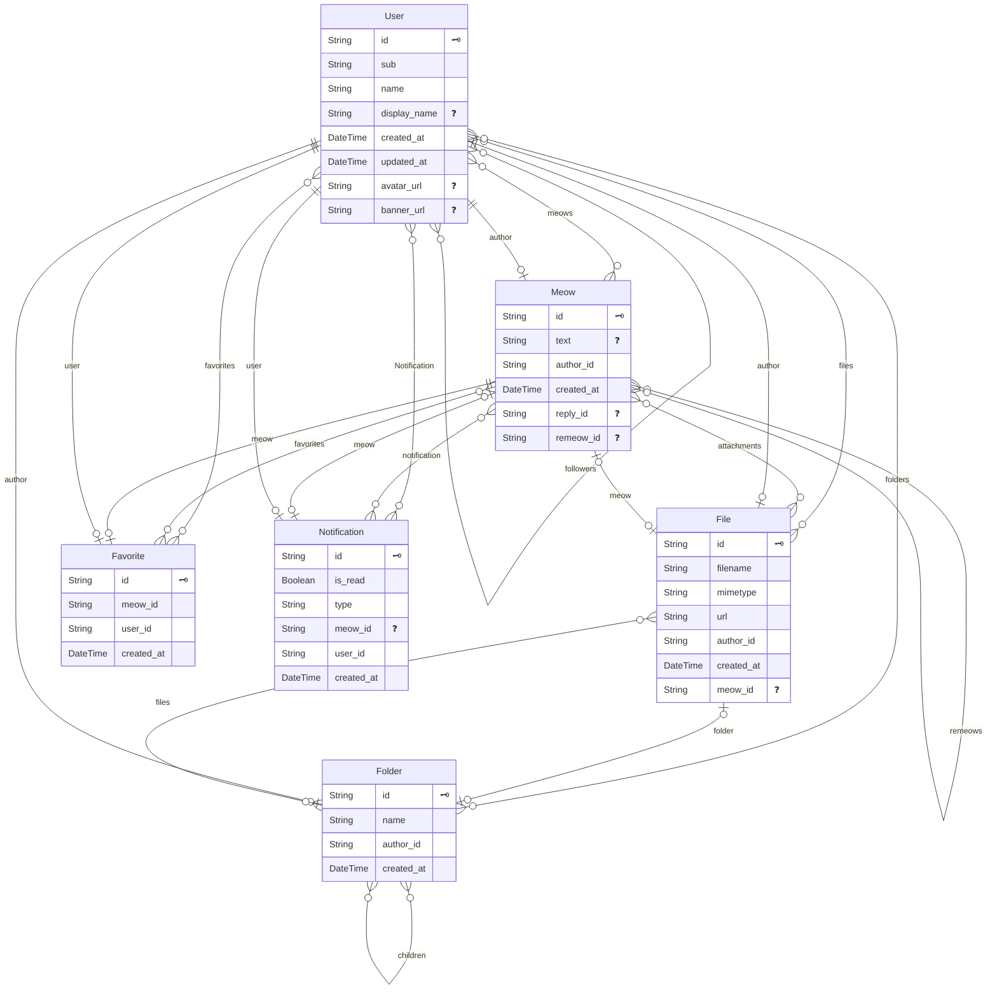

```mermaid
erDiagram

  "User" {
    String id "🗝️"
    String sub 
    String name 
    String display_name "❓"
    DateTime created_at 
    DateTime updated_at 
    String avatar_url "❓"
    String banner_url "❓"
    }
  

  "Folder" {
    String id "🗝️"
    String name 
    String author_id 
    DateTime created_at 
    }
  

  "File" {
    String id "🗝️"
    String filename 
    String mimetype 
    String url 
    String author_id 
    DateTime created_at 
    String meow_id "❓"
    }
  

  "Meow" {
    String id "🗝️"
    String text "❓"
    String author_id 
    DateTime created_at 
    String reply_id "❓"
    String remeow_id "❓"
    }
  

  "Favorite" {
    String id "🗝️"
    String meow_id 
    String user_id 
    DateTime created_at 
    }
  

  "Notification" {
    String id "🗝️"
    Boolean is_read 
    String type 
    String meow_id "❓"
    String user_id 
    DateTime created_at 
    }
  
    "User" o{--}o "Meow" : "meows"
    "User" o{--}o "File" : "files"
    "User" o{--}o "Folder" : "folders"
    "User" o{--}o "Notification" : "Notification"
    "User" o{--}o "User" : "following"
    "User" o{--}o "User" : "followers"
    "User" o{--}o "Favorite" : "favorites"
    "Folder" o|--|| "User" : "author"
    "Folder" o{--}o "File" : "files"
    "Folder" o|--|o "Folder" : "parent"
    "Folder" o{--}o "Folder" : "children"
    "File" o|--|| "User" : "author"
    "File" o|--|o "Meow" : "meow"
    "File" o|--|o "Folder" : "folder"
    "Meow" o|--|| "User" : "author"
    "Meow" o{--}o "File" : "attachments"
    "Meow" o|--|o "Meow" : "reply"
    "Meow" o|--|o "Meow" : "remeow"
    "Meow" o{--}o "Meow" : "replies"
    "Meow" o{--}o "Meow" : "remeows"
    "Meow" o{--}o "Notification" : "notification"
    "Meow" o{--}o "Favorite" : "favorites"
    "Favorite" o|--|| "Meow" : "meow"
    "Favorite" o|--|| "User" : "user"
    "Notification" o|--|o "Meow" : "meow"
    "Notification" o|--|| "User" : "user"
```
