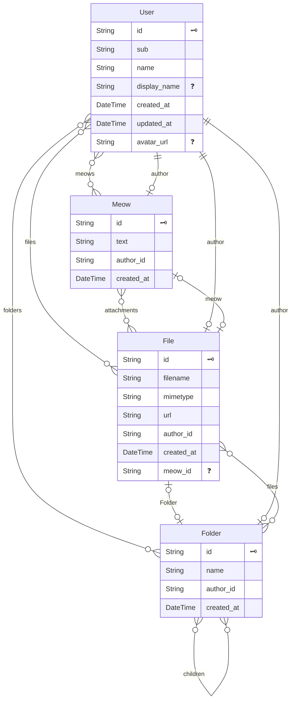

```mermaid
erDiagram

  "User" {
    String id "🗝️"
    String sub 
    String name 
    String display_name "❓"
    DateTime created_at 
    DateTime updated_at 
    String avatar_url "❓"
    }
  

  "Folder" {
    String id "🗝️"
    String name 
    String author_id 
    DateTime created_at 
    }
  

  "File" {
    String id "🗝️"
    String filename 
    String mimetype 
    String url 
    String author_id 
    DateTime created_at 
    String meow_id "❓"
    }
  

  "Meow" {
    String id "🗝️"
    String text 
    String author_id 
    DateTime created_at 
    }
  
    "User" o{--}o "Meow" : "meows"
    "User" o{--}o "File" : "files"
    "User" o{--}o "Folder" : "folders"
    "Folder" o|--|| "User" : "author"
    "Folder" o{--}o "File" : "files"
    "Folder" o|--|o "Folder" : "parent"
    "Folder" o{--}o "Folder" : "children"
    "File" o|--|| "User" : "author"
    "File" o|--|o "Meow" : "meow"
    "File" o|--|o "Folder" : "Folder"
    "Meow" o|--|| "User" : "author"
    "Meow" o{--}o "File" : "attachments"
```
